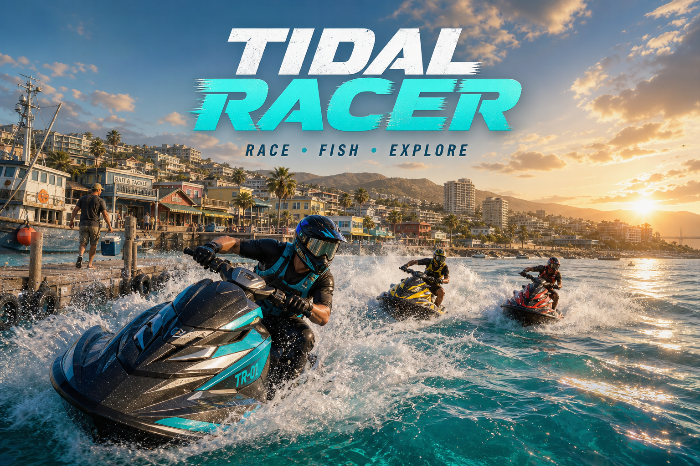

<p align="center">
  
</p>

<h1 align="center">Tidal Racer V18.0.2</h1>

<p align="center">
  <strong>Race rival riders, hunt 27 species of fish, and step ashore into a living coastal city.</strong>
</p>

<p align="center">
  
  
  
  
</p>

Tidal Racer is an original browser-based open-archipelago racing, fishing, and
coastal-life game. The full Three.js runtime, models, textures, and adaptive
music system are bundled locally—no game CDN, account, installer, or telemetry
is required.

## Download and play

### Fastest on Windows

1. Download the newest ZIP from **[GitHub Releases](https://github.com/beerAndNacho/Tidal-Racer-V18.0.2-Local-Three-Fix/releases/latest)**.
2. Extract the ZIP to a new folder.
3. Double-click **`run_local.bat`**.
4. Click **ENTER OPEN ARCHIPELAGO**. This first click unlocks browser audio.

Windows does not need Python, Node.js, npm, or an installation wizard. The
included PowerShell launcher starts a private server on `127.0.0.1` and opens
the game in your default browser.

### Clone the source

```powershell
git clone https://github.com/beerAndNacho/Tidal-Racer-V18.0.2-Local-Three-Fix.git
cd Tidal-Racer-V18.0.2-Local-Three-Fix
.\run_local.bat
```

macOS/Linux users can run `sh run_local.sh`; Python 3 is required there.
Opening `index.html` directly is not supported because browsers restrict local
JavaScript modules and game assets.

## What is already playable

- **Competitive water racing:** an 11-rider grid, countdown, adaptive pack AI,
  overtakes, contact, slipstream, proximity HUD, and ambient traffic
- **Open archipelago:** nine streamed regions with distinct coastlines, cities,
  weather mood, traffic, and region-specific activities
- **Generated coastal paving:** an original 1024px photoreal concrete-slab
  material gives the Golden Coast sidewalk and quay their own salt-worn surface;
  mirrored tiling suppresses edge seams while provenance and SHA-256 remain
  recorded for release auditing
- **Fishing:** 27 species, five rarities, nine regional pools, four tackle tiers,
  persistent records, casting, hooking, tension-based fights, a 24-lot/320 kg
  insulated catch locker, freshness decay, daily demand, auction fees, sales,
  release rewards, and a persistent trade journal
- **Time-and-depth fishing strategy:** four progression-locked baits target
  surface, shallow, mid-water, or deep behaviors; daylight, night, and
  dawn/dusk windows alter attraction and bite speed, with the active bait,
  target depth, and current conditions shown before every cast
- **Position-based habitat sonar:** 36 authored surface, shallow, mid-water,
  and deep habitats turn fishing location into a real choice; an animated
  bow-relative fish finder reports bearing, range, water activity, and echoes,
  while proximity shortens bite time and improves matching-species odds; press
  `H` or gamepad Y/Activity to send the selected habitat to voyage navigation
- **Bait-specific 3D lure presentation:** segmented shore worms, diving
  minnows, cupped surface poppers, and emissive skirted deep jigs hang from a
  visible leader, move differently in the water, and create an entry splash
  when cast
- **Life ashore:** leave the craft at Golden Coast, walk or run through town,
  enter a marina workshop, home, grocery, restaurant, fish auction, bank,
  nightlife venue, or gym, and manage
  energy, hunger, mood, hygiene, money, day, and time; routine actions now play
  short venue-colored sequences with time, cost, need deltas, progress, sound,
  input locking, and rest, meal, shopping, banking, leisure, or training poses
- **Persistent lifestyle preparation:** twelve meals, drinks, leisure choices,
  and workouts grant timed, save-safe effects across four non-exploitable
  groups; active preparation slows hunger and fatigue, improves walking pace,
  steadies fishing control, or adds a small craft-handling edge, with remaining
  time visible in the facility panel, routine result, and life HUD
- **Real grocery-to-home loop:** Coast Market groceries cost 680 CR and stock
  six persistent pantry servings; cooking at home consumes one serving with no
  second charge, while an 18-meal capacity, disabled full/empty actions, result
  feedback, HUD readout, save restoration, and transaction guards prevent
  duplicate spending or unlimited stock
- **Useful personal banking:** venue purchases spend wallet funds first and can
  securely debit only the shortfall from the saved Tidal Bank account; declined
  combined-fund checks never mutate balances, while deposits, withdrawals, and
  card charges create a signed, save-safe 24-entry statement with recent
  activity, receipt payment source, and account telemetry
- **Changing daily venue calendar:** Coast Market, Marina Kitchen, Blue Wave
  Lounge, and Harbor Fitness each rotate three authored daily programs; the
  featured product, plate, performance, or class receives a rounded discount
  and stronger positive benefit without amplifying fatigue costs, with today’s
  program, savings, highlighted action, receipt, and telemetry shown in-world
- **Playable lounge arcade:** the Blue Wave Lounge racing cabinet launches a
  22-second three-lane neon gate run instead of a passive cutscene; keyboard,
  arrows, analog stick, and D-pad support direct lane changes across 29 daily
  route gates, with escalating combo score, accuracy rank, capped credit/XP
  reward, haptics, audio, saved daily best and lifetime high score
- **Playable dance floor:** choosing the Blue Wave Lounge dance session starts
  a 24-second, 39-note four-lane rhythm set with rotating daily choreography,
  keyboard, arrow, and D-pad input, perfect/good/okay/miss timing windows,
  combo, S-D rank, bounded credit/XP rewards, haptics, synthesized cues, saved
  daily and lifetime records, frozen city time, and neon-stick avatar motion
- **Marina garage:** earn and spend credits on ten owned watercraft, four-stage
  powertrain, steering, hull, and catch-locker upgrades, condition-driven
  performance, collision and hard-landing damage, field repair, and full service
- **Tidebound Stories:** a six-chapter bilingual campaign connects named city
  residents, the marina, rival racing, fishing and auction economics, coastal
  rescue, storms, nightlife, banking, and Harbor Network reporting through
  sequential objectives, world/minimap waypoints, dialogue, rewards, and saves
- **Harbor Network:** visit the Golden Coast Harbor Office for rotating timed
  contracts that connect racing, fishing, rescue activities, exploration, and
  city routines through five Harbor Standing tiers and persistent rewards
- **Living city population:** 18 scheduled residents walk the waterfront by
  time of day, visit the commercial district, and share bilingual local tips
  through proximity conversations that affect mood and time
- **East waterfront public realm:** the former street-end boundary now opens
  into a connected pedestrian square and modeled overlook pier with three
  signed kiosks, patterned paving, a reflecting pool and tidal sculpture,
  performance stage and animated musician, benches, planters, entry arch,
  viewfinder, reactive night lighting, two resident routes, local rain shelters,
  and an irregular shoreline mask that prevents walking or framing into water
- **Interactive plaza routines:** all four waterfront benches support saved
  rest with time and needs recovery, the animated musician offers lunch and
  evening sets with exact next-opening guidance and a transaction-safe 100 CR
  tip, and the overlook viewfinder provides a free harbor-watching routine;
  nearby activity rings, E/gamepad prompts, character poses, handheld props,
  receipts, telemetry, and normal life-sequence feedback keep them in-world
- **Spatial waterfront soundscape:** the stage performance now fades in
  smoothly across a 135 m outdoor radius only during its lunch and evening
  schedule, layering a local live riff and audience texture through the
  existing music and ambience controls. Shore surf follows waterfront
  proximity, sparse procedural gull calls avoid repetition, and every outdoor
  layer crossfades out immediately when the player enters an interior
- **Playable daily plaza kiosks:** Coast Coffee, Tide Goods, and Night Bites
  now operate on distinct schedules, rotate through nine bilingual featured
  offers by in-game day, and expose their price and remaining stock on
  physical menu boards. Purchases persist bounded daily inventory, safely
  reject closed, sold-out, or underfunded orders, support wallet, bank card,
  and split payment with ledger entries, restore different needs, animate
  contextual hand props, and replenish only when the next day begins
- **Staffed reactive kiosk service:** three distinct on-shift vendors now use
  articulated faces, natural blink, player-tracking gaze, greeting gestures,
  sold-out body language, and item-specific cup, bag, or food handoffs after
  purchase. Schedule-aware queue customers shift at the counter, service
  lights illuminate open stalls after dark, and distance culling keeps the
  extra people and lights bounded to the active waterfront
- **Playable Coast Shuttle:** three modeled shelters connect Coast Market, the
  fish auction and bank district, and Tidal Square on a saved 120 CR coastal
  loop. Route boards show the 06:00–22:30 service and 30-minute headway;
  prompts expose the next destination and exact wait, while wallet, bank-card,
  and split fares feed the statement. The ride advances both waiting and
  travel time, places the player at the next stop, records persistent transit
  history, and uses a visibly moving shuttle with driver, stop approach,
  reactive door strip, night lamps, boarding pose, haptics, and dedicated audio
- **Transit-aware navigation chart:** the world map now draws the closed
  coastal loop, three schedule-aware stop pins, and the shuttle’s live
  direction from the same position model used by the 3D vehicle. Its objective
  journal reports the nearest stop, next departure, wait and fare; clicking
  near a stop snaps to a saved walking route, changes the navigation HUD, and
  ends with a stop-specific arrival prompt telling the player to press E
- **Pedestrian-aware traffic:** 16 road vehicles now detect an on-foot player
  and all active scheduled citizens in their lane, choose the most urgent of
  multiple hazards, brake from 22 m, stop at close range, illuminate brake
  lamps, recover to cruise speed, sound a restrained horn, and apply
  cooldown-bounded contact pushback only to the player
- **Weather-lit detailed traffic:** those 16 vehicles now carry visible drivers,
  side mirrors, front and rear plates, emissive head and brake lamps, and
  distance-capped night beams; twin tire spray appears only on wet roads at
  speed, so weather adds motion without paying its cost across the whole map
- **Detailed parked streetscape:** ten curbside vehicles fill the authored
  parking bays with compact, wagon, pickup, and delivery silhouettes, including
  mirrors, front and rear plates, lamps, roof racks, and visible parcels.
  Rendering, pedestrian collision, and chase-camera collision share one layout;
  wet clearcoat follows the street weather while nearby delivery vans flash
  restrained hazards after dark under 320 m structure and 135 m detail budgets
- **Reactive courier delivery:** the existing Coast Courier now follows a
  dedicated van-to-loading-bay route through a signal crossing, carries a
  modeled parcel with a two-hand walk pose, pauses to unload, drops the box,
  and returns empty-handed. Crowd yielding, rain sheltering, dialogue, and
  distance culling remain active, while the nearby delivery van detects the
  courier and flashes its hazards during loading
- **Playable Coast Courier contract:** accept the daily route inside Coast
  Market, walk to the delivery van, carry a visible sealed box through three
  business drops, and use both ordered curb checkpoints at the live marina
  signal before finishing at Tidal Square. The 3:10 contract includes
  no-skip checkpoints, distance and timer HUDs, world/minimap/chart guidance,
  a speed bonus, needs and daily gates, cancel/fail outcomes, dedicated cues,
  a 106 BPM courier score that tightens to 118 BPM near timeout, rewards,
  telemetry, and active-route save/resume
- **City work economy:** six venue-specific daily shifts connect sleep, meals,
  hygiene, time of day, and reputation to performance-based wages, persistent
  job skill, promotions, and lifetime earnings
- **Persistent community relationships:** corrected bilingual dialogue for all
  18 residents, individual trust progression, eight personal favors, contextual
  objectives across jobs, dining, banking, fishing, visits, and racing, plus
  return-to-citizen claims and saved rewards
- **Near-field commercial district:** all nine enterable venues have deeper
  facade shells, layered glazing, mullions, transoms, warm interior silhouettes,
  hanging signs, entrance mats, planters, bollards, utilities, and venue-specific
  window displays layered over the moving street population and traffic
- **Layered coastal architecture:** those nine venues now rise into varied
  two-, three-, and four-story blocks with stepped upper massing, recessed
  window bays, balconies, fire escapes, drainage and utility runs, roof
  parapets, HVAC units, vents, water tanks, antennae, dishes, and timed
  apartment lights. A 460 m structural tier preserves the district skyline
  while the existing 205 m tier bounds the denser street-level detail
- **Mixed-use city infill:** eight varied residential and service blocks now
  close the oversized gaps between enterable venues, forming a continuous
  street wall with upper homes, ordinary shopfronts, loading shutters,
  recessed service alleys, deliveries, dumpsters, drainage, rooftop plant,
  and sagging utility cables. Structure, fine alley props, and real security
  lights use separate 520 m, 230 m, and 125 m budgets, with timed occupancy
  lighting giving the district a lived-in night silhouette
- **Daily storefront marquees:** grocery, restaurant, lounge, and gym programs
  rotate with the saved city day on physical color-managed awning signs, update
  their featured service and price without leaking old GPU textures, and respond
  to viewing distance, opening hours, and subtle live illumination
- **Operating city venues:** every facility follows an authored daily schedule,
  including the lounge's overnight shift; closed doors report the next opening
  time while portals, signs, display windows, and storefront lights visibly dim,
  with the home and Harbor Office kept open around the clock for route safety
- **Layered venue interiors:** each enterable space adds city-view window
  silhouettes, architectural trim, columns, ceiling panel lighting, floor
  zoning, entry rugs, plants, wayfinding, and wall sconces while keeping only
  the occupied interior visible; 63 authored furniture colliders stop the player
  passing through beds, counters, shelves, tables, lifts, racks, and gym equipment
- **Staffed service interiors:** 18 role-authored employees, residents, patrons,
  and queued customers occupy the nine venues with articulated idle, service,
  waiting, nightlife, and training motion plus badges, uniforms, aprons, tools,
  a market gavel, and safely spaced layouts that preserve every action and exit
- **Expressive service faces:** every indoor staff member and visitor now has
  modeled eye whites, colored irises, brows, nose, and separated lips with
  staggered blinking, subtle gaze, and role-weighted speech animation so close
  conversations feel responsive without adding shadow cost to tiny face parts
- **Authored marina arrival:** safe disembarking now secures the craft at a
  fixed Golden Coast berth beside a modeled floating pier with deck panels,
  piles, cleats, mooring line, life ring, and time-aware lamps; boarding and
  arrival use bilingual cinematic wipes, locked controls, haptics, and captions
- **Interactive venue service:** opening an activity desk now introduces its
  named on-duty attendant with bilingual local advice; repeated conversations
  rotate persistent role-specific lines while the matching world character
  looks up and gestures, without displacing the 1–4 activity shortcuts
- **Home time control:** the apartment can safely pass one hour or wait until
  the upcoming 07:00 or 18:00 with date rollover, needs simulation, saved usage,
  and the existing routine presentation; sleeping now measures the true time
  until the upcoming morning instead of applying a misleading fixed eight hours
- **Reactive night streets:** 16 collision-aware lamps line both Golden Coast
  sidewalks without blocking venue doors, with inward-facing fixtures,
  distance-culled point lights, road studs, warm light pools, and rain-scaled
  wet-pavement reflections driven by the same world clock and weather surface
- **Weather-reactive pavement:** clear weather now dries the authored street
  puddles instead of leaving permanent glossy patches; rainfall progressively
  darkens and smooths the PBR asphalt, fills nine irregular puddles, and drives
  18 expanding rain rings only while the Golden Coast district is nearby
- **On-foot city wayfinding:** with no custom waypoint selected, the navigation
  HUD becomes a nearest-venue directory with view-relative eight-way arrows,
  distance, live open/closed state, and opening or closing time; the minimap
  draws nine numbered, status-colored facility pins and highlights the nearest
  while custom navigation retains priority and uses a precise 7 m foot arrival
- **Signal-controlled crossings:** two phased Golden Coast crosswalks add 28
  zebra markings, four collidable signal poles, stop lines, vehicle lamps, and
  timed pedestrian WALK/WAIT displays; traffic combines signal and multi-person
  hazards, stops at red or safe amber, lights brake lamps, and suppresses horns
  during ordinary signal waits while the life HUD shows nearby crossing timing
- **Adaptive city ambience:** leaving the craft now hard-mutes its synthesized
  engine and crossfades into time-of-day street traffic and crowds; interiors
  add room tone, venue-specific mechanical hum, and distinct score tempo,
  filtering, and percussion for home, gym, lounge, market, dining, and workshop
- **Articulated city residents:** the 18 scheduled citizens use capsule-based
  anatomy, higher-resolution heads, facial features, role-specific hats, vests,
  packs, instruments, fishing gear, cameras, badges, and headphones, plus head
  look, breathing, torso sway, and gait animation under a 170 m visibility cap
- **Reactive conversations:** a citizen now turns toward the player, pauses
  route movement, plants both feet, nods and gestures during dialogue, then
  returns to the scheduled walking route after a bounded interaction window
- **Expressive close-range faces:** city residents now use eye whites, colored
  irises, pupils, eyebrows, nose volume, and separate lips with staggered blinks,
  player-tracking gaze, rain squints, and speech-driven mouth and brow motion;
  the on-foot premium rider adds head/neck gaze and bone-attached dynamic eyelids
- **Contextual lifestyle props:** 35 apartment, dining, shopping, banking,
  nightlife, and fitness routines now route ten detailed prop groups to the
  premium rider's hand bones, including meals, cups, grocery bags, bank cards,
  phone, remote, towel, pillow, neon sticks, and paired dumbbells, with inactive
  objects hidden at the group root so ordinary walking keeps its normal cost
- **Social weather-aware crowds:** scheduled citizens preserve personal space,
  sidestep one another, yield to the player while tracking them with head turns,
  and distribute across 18 storefront shelters during heavy rain before
  returning to their authored daily routes
- **Responsive on-foot handling:** analog acceleration, reverse-aware steering,
  sprint fatigue, storefront collision damping, subtle pace-driven camera motion,
  boundary-safe chase framing, tall-furniture-aware camera occlusion across all
  nine interiors, dynamic field of view, haptics, live movement
  state, distance-synchronized dry, wet, indoor, and metal footsteps, plus
  sliding collision against storefront planters, trees, benches, cafe furniture,
  bins, hydrants, utility cabinets, and roadwork cones
- **Dynamic coastal weather:** deterministic regional forecasts drive rain,
  wind, marine haze, clouds, lightning, persistent wet PBR streets, puddles,
  wave state, adaptive ambience, and performance-scaled precipitation
- **Nine readable regional silhouettes:** a 3.2 km landmark layer keeps Golden
  Coast's sail tower, Harbor City's gantry cranes, Volcano Bay's smoking caldera,
  Mangrove Delta's giant root arches, Storm Strait's turning turbines, Coral
  Expanse's coral crown, Moon Archipelago's crescent gate, Black Reef's obsidian
  needles, and Skywater Lagoon's waterfall gate visible well before close props
- **Biome-sculpted coastlines:** each island uses a deterministic mix of broad
  headlands, mid-size coves, and fine edge variation instead of a circular
  cylinder; the terrain wall, beach, shallow-water glow, and both animated foam
  bands share the same 128–208 segment outline so shore layers stay registered
- **Regional subsurface depth:** nine smoothly blended shallow/deep water palettes,
  480 frame-paced suspended particles, and seven subtle additive light shafts
  stream around the player below the live wave surface; calm tropical water reads
  clearer while storm, volcanic, harbor, moonlit, and black-reef water stays denser
- **Regional marine ecology:** 27 catchable species now populate nine distinct
  habitat pools with only 9–15 nearby fish active per region; opaque PBR bodies,
  shark gills, billfish rostra, ray wings, serpent segments, reef-fish anatomy,
  schooling, bottom dwelling, bioluminescent pulses, gliding, and surface
  breaches make exploration reflect the same species data used by fishing
- **Physical-looking hull contact:** speed-scaled split bow waves and two curved
  foam ribbons record the craft's actual turning path, widen and dissipate over
  the live wave surface, and layer with crest whitecaps, spray, and cosmetic wake
  color so the craft visibly pushes through the water instead of floating above it
- **Layered craft handling:** throttle spool, displacement-to-planing lift,
  sea-state traction loss, high-speed steering cavitation, reverse-aware yaw,
  soft hull slaps, damaging hard re-entries, impact spray, camera kick, haptics,
  and dedicated audio make every craft respond to speed and water conditions
- **Species-authentic catch reveal:** every landed fish now rebuilds its 3D reveal
  from the same body dimensions, colors, rarity, weight, and behavior data used in
  the ecosystem, including shark gills, billfish rostra, ray wings, oarfish body
  segments, reef-fish jaws, tuna finlets, photophores, and a brief landing wriggle
- **Visible fishing battles:** the hooked species now swims at the line endpoint,
  tracks lateral rod pressure, rides beneath the live wave surface, and animates
  its own tail, ray wings, or segmented body; mahi-mahi, tarpon, barramundi,
  marlin, and arowana can breach near the craft with a surface-locked splash
- **Career and collection:** eight chapters, contracts, season XP, affinity,
  cosmetics, items, events, and persistent progress
- **Resilient voyage saves:** three isolated slots unify story, fishing,
  activities, city life, economy, garage, and career progress with schema
  versioning, checksums, rolling backup recovery, legacy migration, archive
  restore, and portable JSON import/export
- **Real pause control:** `Esc` freezes physics, mission deadlines, world time,
  weather, and playtime; save, export, resume, or safely return to the title
- **Coast License onboarding:** new save slots receive eight action-based,
  bilingual lessons covering acceleration, steering, boost, free roam, docking,
  city interaction, reboarding, and the first catch, with live keyboard/gamepad
  prompts, a dock waypoint, skip/restart controls, and a one-time completion reward
- **Branded photo mode:** press `P` (or open it from Pause) to freeze the world,
  orbit freely, tune distance and FOV, cycle five live filters, hide the HUD,
  and export a PNG carrying region, rider, craft, weather, version, and
  `#TIDALRACER` metadata
- **Interactive world chart:** press `Tab` to pause into a zoomable, pannable
  nine-region chart with the race route, Golden Coast venues, story, contract,
  activity and tutorial journal entries; click anywhere to place a persistent
  custom waypoint that appears in the world and minimap
- **Regional championships:** seven distinct closed-course events span Golden
  Coast, Volcano Bay, Mangrove Delta, Harbor City, Storm Strait, Skywater
  Lagoon, and Moon Archipelago, with reputation gates, event-specific laps and
  difficulty, placement-scaled rewards, saved wins, and personal-best timing
- **Readable, fair courses:** every event renders its own illuminated route,
  paired checkpoint gates, direction chevrons, next-gate beacon and minimap
  target; all gates are required for a valid lap, while an off-course recovery
  returns the craft to the last safe gate with a five-second time penalty
- **Persistent rival tour:** every finish settles the complete 12-rider field
  and awards season points, tracking starts, wins, podiums, streaks, and recent
  form across all seven events; tour rank and rival point gaps appear before,
  during, and after each race
- **Tactical 12-rider pack racing:** eleven rivals scan the player and nearby
  craft before committing to left, center, or right racing lines, slow when boxed
  in, and move into free water to pass; rival V-wakes, alignment-based slipstream
  strength, rank-change cues, haptics, contact damage, and live pack telemetry make
  overtaking a visible interaction instead of independent route-following
- **Presentation:** procedural PBR water, authored facades and riders, adaptive
  score, RPM engine audio, ambience, contextual SFX, GTAO, SMAA, bloom, and
  performance-aware detail scaling
- **Accessible controls:** keyboard remapping, gamepad tuning, five-channel
  audio mixing, effect captions, reduced effects, and high-contrast HUD
- **Korean and English UI:** switch any time with `L`, or launch with
  `?lang=ko` / `?lang=en`

## Controls

| Mode | Keys |
|---|---|
| Craft | `W/↑` throttle · `S/↓` brake/reverse · `A/←` / `D/→` steer |
| Action | `Space` drift/reel · `Shift` boost · `1–4` skills · `E` item |
| World | `F` championship/free roam · `G` fishing · `H` activity · `C` camera |
| Fishing | `Q` cast/hook · `Space` reel · `V` or gamepad View cycle bait |
| City | `X` leave/board craft near Golden Coast dock · `WASD/arrows` move · `Shift` run · `E` interact |
| Courier | `J` or gamepad `Y/Activity` cancel the active Coast Courier route |
| System | `Tab` world map · `P` photo mode · `Esc` pause/save · `R` recover/restart · `M` music · `L` language |

Standard Xbox/PlayStation-compatible gamepads are supported. Keyboard and
gamepad can be switched at any time.

Release testers can press `F10` to open the local evidence recorder. It
measures active-play frame p50/p95, boot time, and runtime errors without
network transmission; a signed JSON export remains locked until 30 active
minutes and all save, control, gamepad, accessibility, fishing/activity,
browser-version, and GPU gates pass.

## Feedback that helps most

If you enjoy the direction, a GitHub star makes the project easier to discover.
For useful reports, open an [Issue](https://github.com/beerAndNacho/Tidal-Racer-V18.0.2-Local-Three-Fix/issues)
and include your browser, GPU, frame rate, region, and exact reproduction steps.

The current build is a **free public preview**, not a claimed AAA or commercial
final release. Automated regression coverage is in place; broader manual
Chrome, Edge, Firefox, and integrated-GPU verification is still ongoing.

## Repository and release safety

- Generated historical builds and source-art working files are excluded from Git.
- **Dependency-closed Three.js package:** release builds recursively follow only
  the add-on imports used by the game and include the required Draco and Basis
  decoders, excluding unrelated WebGPU builds, examples, and authoring tools
  while the full local vendor source remains available in the repository.
- Public-release checks reject common credential patterns, local user paths,
  oversized tracked files, and accidental build copies.
- Runtime code and assets are local; the game stores progress only in browser
  local storage.
- Asset provenance and third-party licenses are documented.
- The versioned engineering data map and commercial EULA, privacy, and support
  drafts are checked against the runtime. They remain visibly unapproved until
  verified publisher information and authorized legal sign-off are supplied.

Run the public checks with:

```powershell
node scripts/public-release-check.mjs
node scripts/legal-data-flow-check.mjs
node scripts/package-smoke-check.mjs
```

## Promotion and press

- [Press kit and project facts](docs/PRESS_KIT.md)
- [Ready-to-post Korean Threads launch copy](docs/promo/THREADS_KO.md)
- [Seven-day Korean Threads campaign](docs/promo/THREADS_CAMPAIGN_KO.md)
- [Launch key art](docs/promo/tidal-racer-launch-key-art.png)

## License

Tidal Racer is free to play and source-available for non-commercial use under
the [Tidal Racer Free Preview License](LICENSE). Gameplay videos, reviews, and
monetized creator coverage are expressly allowed.

Three.js is bundled under the MIT License. Poly Haven and identified Blender
Studio-derived assets are used under their recorded terms. See
[third-party notices](assets/THIRD_PARTY_NOTICES.md), the Three.js
[license](vendor/three/LICENSE), and asset provenance files.
